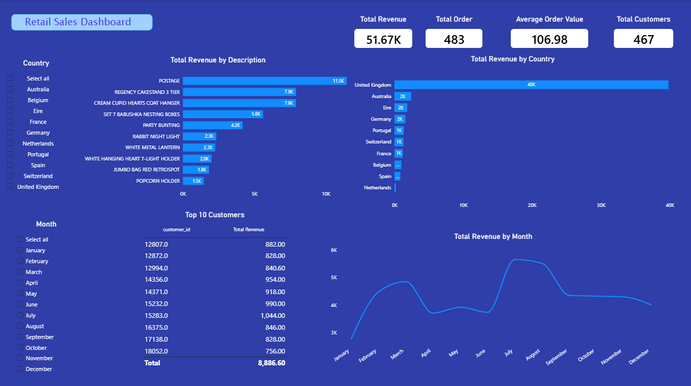

# Retail Sales Power BI Dashboard

A retail sales analysis project that loads transactional data into a MySQL database, validates and cleans it, and visualizes key business metrics in an interactive Power BI dashboard.

## Project Overview
This project demonstrates an end-to-end data workflow:
1. Load raw retail sales data into a MySQL database
2. Clean and validate the data using SQL and Python (Jupyter Notebook)
3. Connect Power BI to MySQL and build an interactive dashboard
4. Validate dashboard figures against the source database

## Tools & Technologies
- MySQL — relational database for storing and querying sales data
- Jupyter Notebook (Python) — data loading and validation
- Power BI Desktop — dashboard and data visualization
- Git/GitHub — version control

## Project Structure
```
retail-sales-powerbi-dashboard/
├── data/          # Raw dataset
├── sql/           # Database schema and setup scripts
├── notebooks/     # Jupyter notebook for loading data into MySQL
├── dashboard/     # Power BI dashboard screenshot/export
├── .gitignore
└── README.md
```

## Dashboard



The dashboard includes:
- Total Revenue, Total Orders, Average Order Value, and Total Customers (KPIs)
- Total Revenue by Product Description
- Total Revenue by Country
- Total Revenue by Month
- Top 10 Customers by Revenue
- Filters by Country and Month

## KPI Definitions
- **Total Revenue** = SUM(revenue) across all valid orders
- **Total Orders** = COUNT of transactions with a valid customer ID
- **Average Order Value** = Total Revenue ÷ Total Orders
- **Total Customers** = DISTINCT COUNT of customer IDs

## Data Cleaning & Validation
The raw dataset loaded into MySQL contains 493 transaction records. During Power BI dashboard development, 10 records with unidentified customer IDs were excluded, as they could not be attributed to a specific customer and would distort customer-level analysis (e.g., Top 10 Customers, Total Customers).

Validation summary (MySQL source vs. Power BI dashboard):

| Metric | MySQL (raw) | Power BI (cleaned) | Difference |
|---|---|---|---|
| Total Orders | 493 | 483 | -10 |
| Total Customers | 468 | 467 | -1 |
| Total Revenue | 53,057.56 | 51,670 (approx.) | -1,387.56 |
| Avg Order Value | 107.62 | 106.98 | -0.64 |

This difference is expected and intentional — it reflects the removal of orders lacking valid customer attribution, not a data loading error.

## How to Reproduce
1. Clone this repository
2. Run `sql/database_setup.sql` in MySQL to create the database and table
3. Create a `.env` file with your MySQL credentials
4. Run `notebooks/load_to_mysql.ipynb` to load and validate the data
5. Open Power BI Desktop and connect to your local MySQL database
6. Load the `dashboard.pbix` file (if included) or rebuild visuals as shown above

## Author
Emmanuel Twumasi Kwame Yeboah
